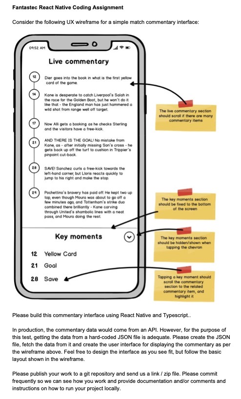
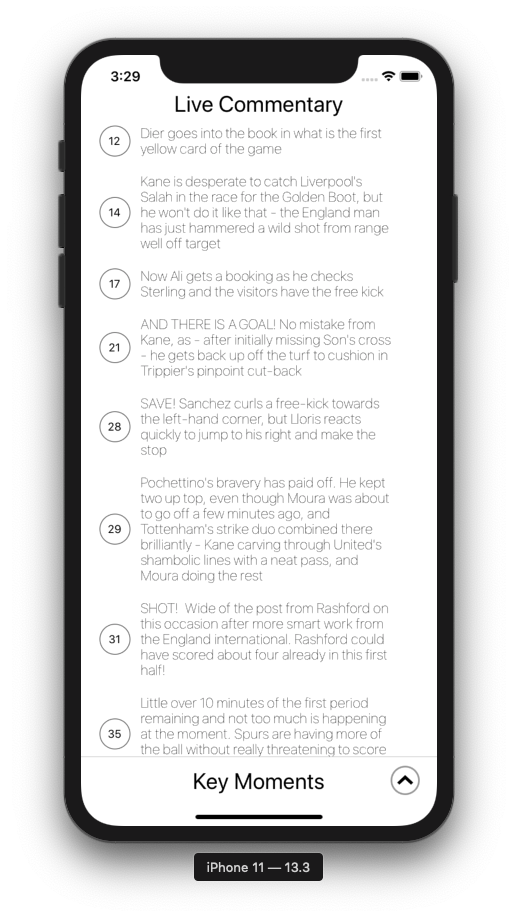
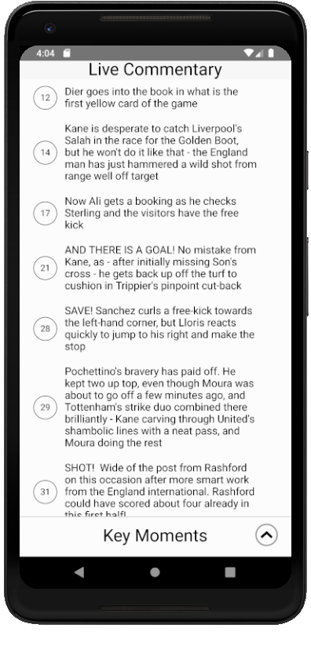
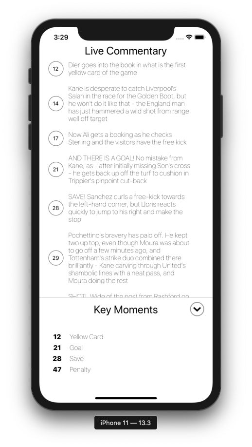
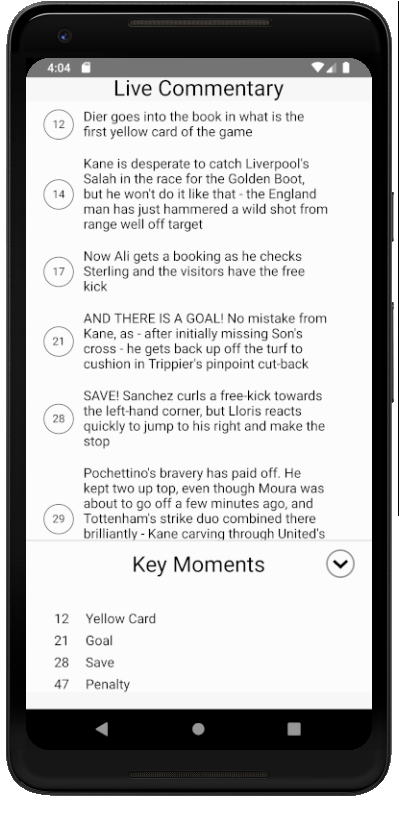
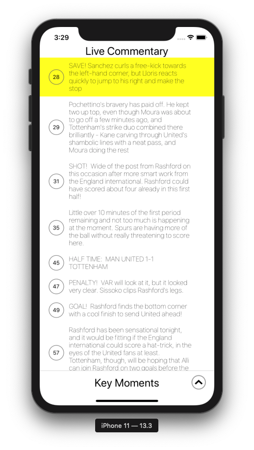
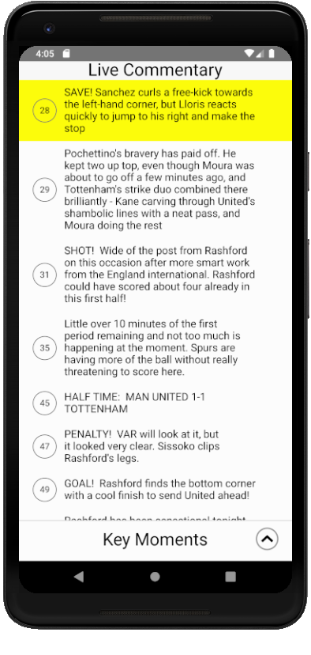

### Quick Commentary App

Using React Native, being given a set of select requirements, created a quick football commentary app. Works on both iOS & Android.

### Requirement

This was the requirement...



### Running it locally
###### I have an assumption that you've run a React Native project before, so no prerequisites will be listed.

To run on iOS

```yarn ios```

To run on Android
###### *** you will need a local.properties file added to your android folder that shows the path to your Android SDK. ***
```yarn android```

### Screenshots
#### Main Screen

|                                  iOS | Android                                  |
| -----------------------------------: | :--------------------------------------- |
|  |  |

#### Opened Modal

|                                  iOS | Android                                  |
| -----------------------------------: | :--------------------------------------- |
|  |  |

#### Chosen Event

|                                  iOS | Android                                  |
| -----------------------------------: | :--------------------------------------- |
|  |  |

### Gifs

|                                      iOS | Android                                           |
| ---------------------------------------: | :------------------------------------------------ |
|  | .gif) |